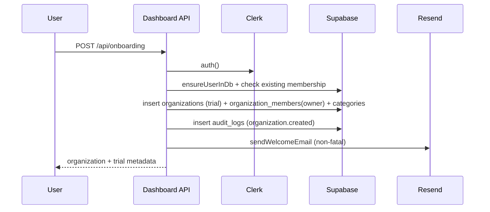
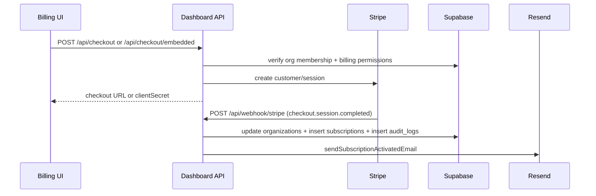
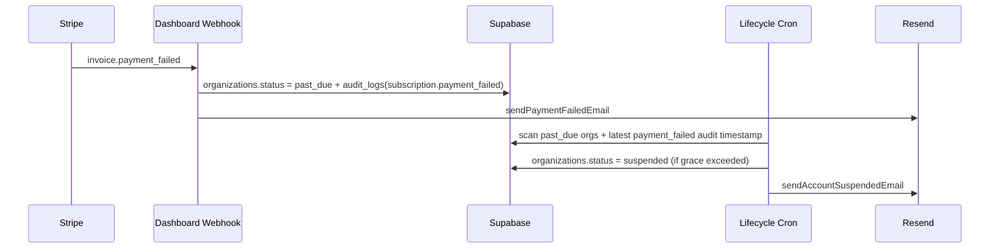
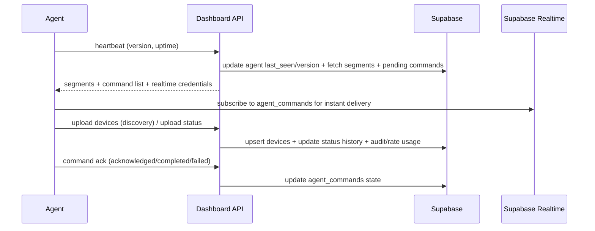
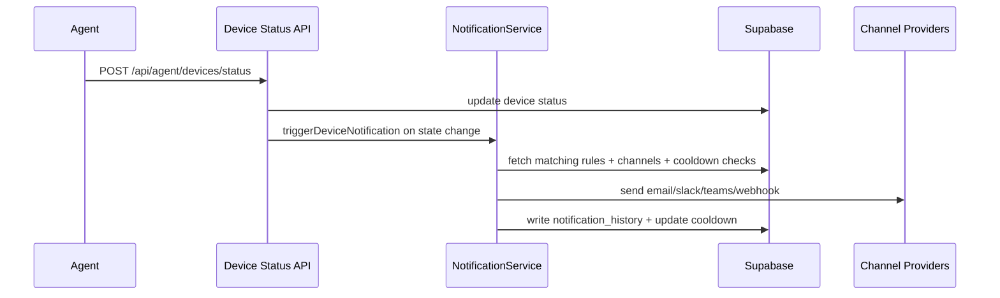
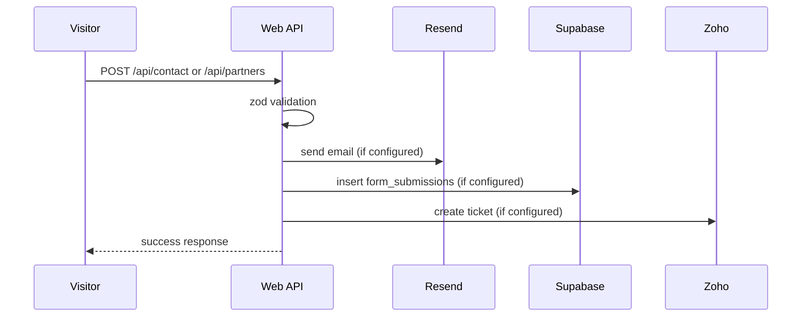

# VelocityPulse Technical Baseline

Date: 2026-02-11  
Scope: Phase 0 baseline for end-to-end commercial readiness review.

## 1. Repository Topology

Monorepo root contains three deployable applications plus shared migration/docs assets:

- `velocitypulse-dashboard`: SaaS app (Next.js 16, Clerk, Stripe, Supabase, Resend, Sentry)
- `velocitypulse-web`: marketing site + installer distribution host routes (`get.velocitypulse.io`)
- `velocitypulse-agent`: Node/TypeScript network agent + installer scripts
- `supabase/migrations`: primary SQL migration set (001-012)
- `velocitypulse-dashboard/supabase/migrations`: additional migration set (timestamped)

Current rough size indicators:

- Dashboard API routes: `79` (`velocitypulse-dashboard/src/app/api/**/route.ts`)
- Dashboard pages: `34` (`velocitypulse-dashboard/src/app/**/page.tsx`)
- Marketing API routes: `5` (`velocitypulse-web/app/api/**/route.ts`)
- Agent source files: `32` (`velocitypulse-agent/src/**`)
- Agent installer scripts: `5` (`velocitypulse-agent/scripts/**`)

## 2. Runtime Architecture

## 2.1 Deployed Surfaces

- Dashboard: `app.velocitypulse.io` (Vercel project rooted at `velocitypulse-dashboard`)
- Marketing: `velocitypulse.io` (Vercel project rooted at `velocitypulse-web`)
- Installer host behavior: `get.velocitypulse.io` rewritten by `velocitypulse-web/vercel.json`
  - `/agent` -> `velocitypulse-web/app/api/get/agent/route.ts`
  - `/agent.sh` -> `velocitypulse-web/app/api/get/agent-sh/route.ts`
- Database and realtime: Supabase
- Auth: Clerk (plus Clerk webhook sync into Supabase `users`)
- Payments: Stripe
- Email: Resend (dashboard + web forms); Zoho optional for marketing form ticketing
- Error tracking: Sentry

## 2.2 Dashboard Execution Boundary

- Main app is Next.js App Router (`velocitypulse-dashboard/src/app`)
- Security middleware in `velocitypulse-dashboard/src/proxy.ts` enforces:
  - route auth/public segmentation
  - internal staff gate (`users.is_staff`)
  - org status redirects (`suspended`, `cancelled`, expired trial)
  - in-memory route-level rate limits
  - CSP/security headers
- Optional separate custom Node server with Socket.IO (`velocitypulse-dashboard/server.ts`, `velocitypulse-dashboard/src/lib/socket/*`)

## 2.3 Agent Execution Boundary

- Entry point: `velocitypulse-agent/src/index.ts`
- REST transport to dashboard: `velocitypulse-agent/src/api/client.ts`
- Realtime command channel via Supabase Realtime: `velocitypulse-agent/src/api/realtime.ts`
- Optional Socket.IO client exists (`velocitypulse-agent/src/api/socket.ts`) but main runtime path is heartbeat + Supabase realtime.

## 2.4 Marketing Execution Boundary

- Next.js app router (`velocitypulse-web/app`)
- API routes used for forms + installer script serving:
  - `app/api/contact/route.ts`
  - `app/api/partners/route.ts`
  - `app/api/get/agent/route.ts`
  - `app/api/get/agent-sh/route.ts`
  - `app/api/health/route.ts`
- Global security/rate-limit middleware: `velocitypulse-web/middleware.ts`

## 3. Data Model Baseline (Supabase)

Primary schema baseline is established in `supabase/migrations/001_multi_tenant_schema.sql` and evolved by `002-012`.

Core tables:

- Tenant and membership: `organizations`, `organization_members`, `users`
- Monitoring: `agents`, `network_segments`, `devices`, `agent_commands`, `agent_pings`, `device_status_history`
- Billing/governance: `subscriptions`, `audit_logs`, `api_usage_monthly`, `api_usage_hourly`
- Notifications: `notification_channels`, `notification_rules`, `notification_history`, `notification_cooldowns`
- Operations/admin: `admin_roles`, `admin_audit_logs`, `support_tickets`, `ticket_comments`, `invitations`

State-heavy columns:

- Organization status: `trial | active | past_due | suspended | cancelled`
- Plan: `trial | starter | unlimited`
- Command status includes `acknowledged` after migration 012.

RLS:

- RLS policies defined in `supabase/migrations/002_rls_policies.sql`
- Most application API routes use Supabase service role (`createServiceClient`) and bypass client-side RLS.

## 4. AuthN/AuthZ Baseline

## 4.1 Human User Auth

- Clerk session validation in route handlers via `auth()` (`@clerk/nextjs/server`)
- User profile cache in Supabase `users` table:
  - Clerk webhook sync: `velocitypulse-dashboard/src/app/api/webhook/clerk/route.ts`
  - fallback seeding in API code: `velocitypulse-dashboard/src/lib/api/ensure-user.ts`
- Organization-level permissions resolved from `organization_members.role` + `permissions` JSON.

## 4.2 Internal Admin Auth

- Gate: `verifyInternalAccess` in `velocitypulse-dashboard/src/lib/api/internal-auth.ts`
- Uses `users.is_staff` + optional `admin_roles` hierarchy.

## 4.3 Agent Auth

- API key headers supported by `authenticateAgent()`:
  - `x-agent-key`, `x-api-key`, or `Authorization: Bearer ...`
  - implementation: `velocitypulse-dashboard/src/lib/api/agent-auth.ts`
- Key verification and rotation grace-period support:
  - `velocitypulse-dashboard/src/lib/api/agent-key.ts`
  - supports current key or `previous_api_key_hash` until `previous_api_key_expires_at`

## 5. Billing and Plan Logic Baseline

Plan and limit constants:

- Dashboard canonical plan constants: `velocitypulse-dashboard/src/lib/constants.ts`

Checkout and billing APIs:

- Checkout:
  - `velocitypulse-dashboard/src/app/api/checkout/route.ts`
  - `velocitypulse-dashboard/src/app/api/checkout/embedded/route.ts`
- Billing:
  - `.../api/billing/subscription`
  - `.../api/billing/details`
  - `.../api/billing/portal`
  - `.../api/billing/change-plan`
  - `.../api/billing/cancel`
  - `.../api/billing/reactivate`
  - `.../api/billing/update-payment`

Stripe webhook source of truth:

- `velocitypulse-dashboard/src/app/api/webhook/stripe/route.ts`
- Handles:
  - `checkout.session.completed`
  - `customer.subscription.updated`
  - `customer.subscription.deleted`
  - `invoice.payment_failed`
  - `invoice.payment_succeeded`

Lifecycle cron (trial/dunning/retention):

- `velocitypulse-dashboard/src/app/api/cron/lifecycle/route.ts`
- Scheduled in `velocitypulse-dashboard/vercel.json` (`0 */6 * * *`)

## 6. Email and Notification Baseline

Lifecycle/invitation/admin email templates and send function:

- `velocitypulse-dashboard/src/lib/emails/lifecycle.ts`

Primary dashboard email trigger points:

- Onboarding welcome: `velocitypulse-dashboard/src/app/api/onboarding/route.ts`
- Stripe lifecycle emails: `velocitypulse-dashboard/src/app/api/webhook/stripe/route.ts`
- Cron lifecycle emails: `velocitypulse-dashboard/src/app/api/cron/lifecycle/route.ts`
- Member invite/add flows: `velocitypulse-dashboard/src/app/api/dashboard/members/route.ts`
- Invitation resend: `velocitypulse-dashboard/src/app/api/dashboard/invitations/[id]/resend/route.ts`
- Internal org messaging: `velocitypulse-dashboard/src/app/api/internal/organizations/[id]/message/route.ts`

Monitoring notification engine:

- Core dispatcher: `velocitypulse-dashboard/src/lib/notifications/service.ts`
- Channel senders:
  - email: `velocitypulse-dashboard/src/lib/notifications/senders/email.ts`
  - Slack/Teams/webhook equivalents in sibling files
- Triggered from device status route:
  - `velocitypulse-dashboard/src/app/api/agent/devices/status/route.ts`

Marketing form email flow:

- Form APIs: `velocitypulse-web/app/api/contact/route.ts`, `velocitypulse-web/app/api/partners/route.ts`
- Delivery fan-out (Resend + Supabase + Zoho):
  - `velocitypulse-web/lib/form-delivery.ts`

## 7. Agent and Installer Integration Baseline

Agent-server integration routes:

- Heartbeat: `velocitypulse-dashboard/src/app/api/agent/heartbeat/route.ts`
- Discovery upload: `velocitypulse-dashboard/src/app/api/agent/devices/discovered/route.ts`
- Status upload: `velocitypulse-dashboard/src/app/api/agent/devices/status/route.ts`
- Command ack: `velocitypulse-dashboard/src/app/api/agent/commands/[commandId]/ack/route.ts`
- Auto segment register: `velocitypulse-dashboard/src/app/api/agent/segments/register/route.ts`

Installer source files:

- Linux/macOS: `velocitypulse-agent/scripts/install-linux.sh`
- Windows: `velocitypulse-agent/scripts/install-windows.ps1`

Installer distribution in marketing app:

- Inlined Windows script: `velocitypulse-web/app/api/get/agent/route.ts`
- Inlined Linux/macOS script: `velocitypulse-web/app/api/get/agent-sh/route.ts`
- Both files explicitly state agent scripts are source of truth and must be kept in sync.

Release pipeline baseline:

- Agent release workflow: `.github/workflows/agent-release.yml`
- Builds archive artifacts from `velocitypulse-agent`, tags as `agent-v*`

## 8. Sequence Flow Baselines

## 8.1 User Onboarding and Trial Creation

## 8.2 Checkout to Subscription Activation

## 8.3 Payment Failure, Grace Period, Suspension

## 8.4 Agent Runtime Loop

## 8.5 Notification Trigger and Dispatch

## 8.6 Marketing Form Delivery

## 9. Source-of-Truth Matrix (Baseline)

| Domain | Canonical Source | Supporting Sources | Notes |
|---|---|---|---|
| DB schema | `supabase/migrations/001-012` | `supabase/config.toml` | Additional migration directory exists under dashboard project |
| Plan limits + trial duration | `velocitypulse-dashboard/src/lib/constants.ts` | `supabase` organization fields | Used by onboarding, billing updates, rate limits |
| Stripe lifecycle state transitions | `velocitypulse-dashboard/src/app/api/webhook/stripe/route.ts` | billing APIs + cron | Webhook is primary transition handler |
| Trial/dunning/retention enforcement | `velocitypulse-dashboard/src/app/api/cron/lifecycle/route.ts` | `velocitypulse-dashboard/vercel.json` | Scheduled every 6 hours |
| Agent authentication + key rotation | `velocitypulse-dashboard/src/lib/api/agent-auth.ts` and `agent-key.ts` | rotate-key route | Supports current and previous key hashes |
| Agent command lifecycle | `.../api/dashboard/agents/[id]/commands/*` + `.../api/agent/commands/[commandId]/ack/route.ts` | migration 012 | includes `acknowledged` state |
| Lifecycle/invite emails | `velocitypulse-dashboard/src/lib/emails/lifecycle.ts` | routes invoking helpers | Resend-based, mostly non-fatal sends |
| Monitoring notifications | `velocitypulse-dashboard/src/lib/notifications/service.ts` | senders + status route trigger | Rules/channels/cooldown in DB |
| Marketing form delivery | `velocitypulse-web/lib/form-delivery.ts` | web form APIs | fan-out to Resend/Supabase/Zoho |
| Installer scripts | `velocitypulse-agent/scripts/install-linux.sh`, `install-windows.ps1` | inlined copies in `velocitypulse-web/app/api/get/*` | Declared source of truth is agent scripts |
| Agent release packaging | `.github/workflows/agent-release.yml` | `velocitypulse-agent/package.json` + version.ts | Tag format `agent-v*` |

## 10. Baseline Gaps / Unknowns for Next Phases

1. Migration source-of-truth ambiguity:
   - both `supabase/migrations` and `velocitypulse-dashboard/supabase/migrations` exist; ownership and ordering policy is not yet explicitly documented.
2. Script sync process for installers:
   - web-served installer routes contain large inlined script copies; no automated sync/check was found in baseline scan.
3. Runtime deployment shape for Socket.IO path:
   - local/self-hosted server exists (`server.ts`), but production operational model for socket server is not fully specified in-repo.
4. Stripe lifecycle completeness:
   - baseline confirms core events handled, but refund/dispute edge-flow handling policy must be validated in Stripe phase.
5. Email deliverability observability:
   - sends are often non-fatal; central alerting/reporting on failed sends needs validation in later phases.
6. Test coverage concentration:
   - dashboard has many routes (`79`) but few route tests (`5` route tests + `1` e2e smoke); high-risk path coverage needs deeper review.

## 11. Inputs Ready for Phase 1

Baseline artifacts now identified for deep review:

- Dashboard deep-review focus files:
  - `velocitypulse-dashboard/src/app/api/billing/**`
  - `velocitypulse-dashboard/src/app/api/webhook/stripe/route.ts`
  - `velocitypulse-dashboard/src/app/api/cron/lifecycle/route.ts`
  - `velocitypulse-dashboard/src/lib/notifications/**`
- Agent/installer focus files:
  - `velocitypulse-agent/src/index.ts`, `src/api/client.ts`, `src/api/realtime.ts`
  - `velocitypulse-agent/scripts/install-linux.sh`, `scripts/install-windows.ps1`
  - `velocitypulse-web/app/api/get/agent/route.ts`
  - `velocitypulse-web/app/api/get/agent-sh/route.ts`
- Marketing focus files:
  - `velocitypulse-web/app/pricing/page.tsx`
  - `velocitypulse-web/app/legal/terms/page.tsx`
  - `velocitypulse-web/lib/form-delivery.ts`
  - `velocitypulse-web/app/api/contact/route.ts`, `partners/route.ts`
